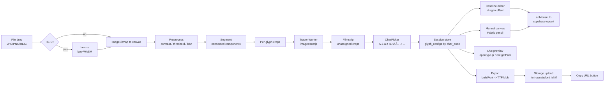

# feat: FontLine MVP — photo of handwriting to installable .ttf

## Overview

Build a greenfield browser-only web app that turns a photo of a hand-drawn alphabet into an installable `.ttf` font in under ~5 seconds per page. Users can adjust per-glyph vertical offset and scale on a virtual baseline, preview live with custom strings including Norwegian (`Blåbærsyltetøy`), draw missing glyphs with a pencil brush, export via `opentype.js`, and persist the session to Supabase (no RLS, `anon` key, public bucket).

Stack fixed by the user: **React + Vite + TypeScript + Fabric.js + imagetracerjs + opentype.js + @supabase/supabase-js v2**.

## Problem Frame

PRD.md describes a tool for designers/artists that digitises handwriting into a font with **per-glyph y-offset and scale control**, a filmstrip UI, a drag-on-lined-paper baseline editor, and a manual canvas for forgotten/missing glyphs. Persistence is deliberately **public-first** via Supabase `anon`, keyed by a UUID stored in `localStorage`, so sharing is one copy-and-paste away.

This plan wires the end-to-end happy path (upload → segment → trace → assign char → adjust → export → upload → copy URL) plus the manual-canvas side door, **without** auth, server-side processing, or a build pipeline more complex than Vite.

## Requirements Trace

- **R1.** Upload JPG / PNG / HEIC (PRD §3.1); HEIC decoded client-side.
- **R2.** Preprocessing filters: contrast, threshold, sharpen/blur (PRD §3.1).
- **R3.** Automatic segmentation of individual glyphs from a grid/line page (PRD §3.1).
- **R4.** Vectorisation of each raster segment → SVG path preserving texture (PRD §3.1).
- **R5.** Glyph editor: per-glyph vertical offset (int) and scale (float) with live preview of arbitrary strings, Norwegian included (PRD §3.2).
- **R6.** Drag-and-drop baseline: click-drag a glyph on virtual lined paper to change its offset (PRD §5).
- **R7.** Manual canvas for missing glyphs: vector brush, eraser, ghost background of a similar letter (PRD §3.3).
- **R8.** Character set: A–Z, a–z, Æ Ø Å æ ø å, and `! ? . , : ; - _ ( ) " ' @ # &` (PRD §3.4).
- **R9.** `opentype.js` export produces a `.ttf` that installs on Windows/macOS and works in Adobe/Figma (PRD §4.2, §6).
- **R10.** Supabase `fonts` + `glyph_configs` tables with RLS disabled; `font-assets` public bucket (PRD §7).
- **R11.** Auto-save on glyph drag `onMouseUp` via `upsert` to `glyph_configs` (PRD §7.3.1).
- **R12.** `font_id` (UUID) persisted in `localStorage`; on refresh, session restored from DB (PRD §7.7).
- **R13.** "Copy Font URL" button returns the public storage link (PRD §7.7).
- **R14.** Latency budget: image → vectors < 5 s (PRD §6).
- **R15.** Minimalist dark-mode workspace with bottom filmstrip (PRD §5).

## Scope Boundaries

- No authentication, no user accounts, no multi-tenancy.
- No server-side image processing or API routes. All compute client-side.
- No kerning pairs, ligatures, hinting, or variable-font axes — baseline `cmap` coverage only.
- No OTF output; TTF only.
- No mobile-first responsive polish; desktop-first dark UI.
- No collaborative editing or live presence.
- No undo/redo history beyond per-stroke on the manual canvas (Fabric's built-in).

### Deferred to Separate Tasks

- **Cron cleanup of >30-day fonts** (PRD §7.6): design noted in Supabase; actual scheduled job deferred to a follow-up once real storage growth is observed.
- **Pressure-sensitive brush** (PRD §3.3): v1 ships fixed-width; pointer-pressure upgrade is a follow-up.
- **Full nodes-and-handles path editor** (PRD §3.3): v1 ships brush + eraser + stroke-delete; point-level bezier editing is a follow-up.

## Context & Research

### Relevant Code and Patterns

Greenfield repo — no existing patterns. Conventions to establish in Unit 1:

- `src/` Vite + React + TS, strict mode on.
- Module layout: `src/app/` (shell, routes), `src/features/<feature>/` (upload, segmentation, editor, manual, export), `src/lib/` (supabase client, opentype wrapper, tracer wrapper), `src/components/` (shared UI), `src/types.ts` (shared types: `GlyphConfig`, `FontSession`, `CharCode`).
- State: `zustand` for session state (single store — MVP doesn't justify Redux).
- Styling: CSS Modules + CSS vars for dark-mode palette.
- Path convention: all file refs in this plan are repo-relative.

### Institutional Learnings

No `docs/solutions/` entries yet — greenfield.

### External References

All surfaced by Phase 1 research; the non-obvious ones are pulled into **Key Technical Decisions** so they don't get buried:

- opentype.js (font synthesis API, glyph + path + font construction).
- imagetracerjs (`imagedataToTracedata` shape; frozen library but adequate).
- Fabric.js v6 (ESM + v6 types; `PencilBrush`; `path:created` event).
- `@erase2d/fabric` — EraserBrush was **removed from Fabric core in v6** and lives here.
- `@supabase/supabase-js` v2 (upsert with composite `onConflict`, Storage `upload`/`getPublicUrl`).
- `heic-to` — 2026 replacement for abandoned `heic2any`; tracks current libheif.

## Key Technical Decisions

- **Vite + React + TypeScript** (not Next.js): client-only app, no SSR, no routes-as-files need; Vite dev server is fastest for heavy canvas work.
- **Zustand over Redux/Context-gymnastics**: the session is a flat record keyed by `char_code`; Zustand is 1 KB and gives us `subscribe` for autosave debouncing.
- **Per-glyph trace, not whole-page trace**: imagetracerjs is synchronous and slow on large images. Segmenting first (fast flood-fill on a thresholded bitmap) then tracing each ~150×150 crop keeps us under the 5 s budget and sidesteps the "many blobs merged into one `<path>`" limitation of `imagedataToSVG`.
- **Trace in a Web Worker**: imagetracerjs is CPU-bound and blocks the main thread; a dedicated worker keeps the UI responsive and lets us parallelise across glyphs.
- **Otsu threshold before trace**: cleaner input paths than relying on `blurradius`; also what segmentation needs anyway — do it once, reuse.
- **Manual click-to-assign char mapping** (user-chosen): after segmentation, filmstrip shows unassigned crops; user clicks a crop and picks the character from a keyboard-navigable picker covering the full PRD character set.
- **`anon` key stays client-side in `VITE_SUPABASE_ANON_KEY`**: by PRD design — "public-first"; documented in README as an intentional non-threat.
- **Composite unique index `(font_id, char_code)` on `glyph_configs`**: required for `upsert` with `onConflict: 'font_id,char_code'` to actually upsert rather than silently fall back to insert-only.
- **TTF `unitsPerEm: 1000`, `ascender: 800`, `descender: -200`**: standard, matches opentype.js examples, renders cleanly in Adobe/Figma.
- **Coordinate flip on path build**: SVG (and Fabric) use Y-down; TTF uses Y-up with baseline at 0. Convert exactly once, in the export step.
- **Hole winding**: reverse counter-clockwise sub-paths on import so opentype.js's non-zero fill renders them as holes, not filled blobs.
- **`.notdef` + space glyph mandatory**: added to every exported font; without `.notdef` Windows DirectWrite rejects the TTF.
- **`font/ttf` content-type on upload**, `upsert: true`: re-exports overwrite in place so the "Copy URL" link is stable across exports for the same `font_id`.
- **HEIC conversion via `heic-to`, lazy-loaded**: 1.5 MB WASM only fetched when a `.heic` is actually dropped; Safari's native HEIC support detected first and used if available.
- **No RLS is an explicit policy, not a mistake**: encoded in the README and in a schema comment so a later engineer doesn't "fix" it.

## Open Questions

### Resolved During Planning

- *Which canvas and tracer?* → Fabric.js + imagetracerjs (user choice).
- *Which frontend scaffold?* → Vite + React + TS (simplest fit for a client-only canvas app).
- *How are detected glyphs mapped to char codes?* → Manual click-to-assign (user choice).
- *How do we hit the <5 s budget?* → Segment first, trace per-crop, Web Worker.
- *How do Norwegian glyphs get into the font?* → Standard BMP codepoints (U+00C5/C6/D8/E5/E6/F8); opentype.js writes a format-4 cmap that covers them automatically.
- *Eraser in Fabric v6?* → `@erase2d/fabric` package (not fabric core).

### Deferred to Implementation

- **Exact segmentation algorithm tuning** (min blob area, merge thresholds for dotted i/j): needs real photos to tune; choose starting constants and refine when we see test images.
- **Exact `pathomit` and `ltres`/`qtres` values for imagetracerjs**: same — tune against real scans.
- **UX of the character picker** (grid layout vs. keyboard-driven): sketch the grid first, revise after the filmstrip interaction feels real.
- **Whether to move tracing to `OffscreenCanvas` inside the worker**: defer until we measure; main-thread `ImageData` pass-through via `postMessage` may be fine.

## Output Structure

    fontline/
    ├── index.html
    ├── package.json
    ├── tsconfig.json
    ├── vite.config.ts
    ├── .env.example
    ├── README.md
    ├── supabase/
    │   └── schema.sql
    ├── public/
    │   └── favicon.svg
    └── src/
        ├── main.tsx
        ├── App.tsx
        ├── app/
        │   ├── Layout.tsx
        │   └── theme.css
        ├── components/
        │   ├── Filmstrip.tsx
        │   ├── CharPicker.tsx
        │   └── Button.tsx
        ├── features/
        │   ├── upload/
        │   │   ├── UploadDropzone.tsx
        │   │   └── preprocess.ts
        │   ├── segmentation/
        │   │   ├── segment.ts
        │   │   └── tracer.worker.ts
        │   ├── editor/
        │   │   ├── GlyphEditor.tsx
        │   │   ├── BaselinePaper.tsx
        │   │   └── LivePreview.tsx
        │   ├── manual/
        │   │   └── ManualCanvas.tsx
        │   └── export/
        │       ├── buildFont.ts
        │       └── ExportBar.tsx
        ├── lib/
        │   ├── supabase.ts
        │   ├── persistence.ts
        │   ├── heic.ts
        │   └── pathUtils.ts
        ├── store/
        │   └── session.ts
        ├── types.ts
        └── test/
            ├── buildFont.test.ts
            ├── pathUtils.test.ts
            ├── segment.test.ts
            ├── preprocess.test.ts
            └── persistence.test.ts

## High-Level Technical Design

> *This illustrates the intended approach and is directional guidance for review, not implementation specification. The implementing agent should treat it as context, not code to reproduce.*



Session state shape (sketch — not implementation):

```
FontSession {
  fontId: string (UUID)
  name: string
  unitsPerEm: 1000
  ascender: 800
  descender: -200
  glyphs: Record<CharCode, {
    svgPath: string
    verticalOffset: int  // font units
    scale: float          // 1.0 default
    sourceBounds: { w, h } | null  // null for manually drawn
    updatedAt: iso8601
  }>
}
```

Supabase schema (sketch):

```
fonts (
  id uuid primary key,
  name text,
  units_per_em int default 1000,
  ascender int default 800,
  descender int default -200,
  created_at timestamptz default now(),
  updated_at timestamptz default now()
) -- RLS disabled

glyph_configs (
  font_id uuid references fonts(id) on delete cascade,
  char_code int not null,
  vertical_offset int default 0,
  scale real default 1.0,
  svg_path text not null,
  updated_at timestamptz default now(),
  primary key (font_id, char_code)
) -- RLS disabled, unique(font_id,char_code) implied by PK

storage bucket 'font-assets' public
```

## Implementation Units

- [ ] **Unit 1: Project scaffold + tooling**

  **Goal:** Stand up a runnable Vite + React + TS shell with strict tsconfig, Vitest, ESLint, `.env.example`, README, and the folder skeleton from Output Structure.

  **Requirements:** foundation for R1–R15.

  **Dependencies:** none.

  **Files:**
  - Create: `package.json`, `tsconfig.json`, `vite.config.ts`, `.env.example`, `.gitignore`, `index.html`, `README.md`
  - Create: `src/main.tsx`, `src/App.tsx`, `src/app/Layout.tsx`, `src/app/theme.css`, `src/types.ts`
  - Create: `public/favicon.svg`
  - Test: `src/test/smoke.test.ts`

  **Approach:**
  - `npm create vite@latest` equivalent by hand (no interactive scaffolder). Deps: `react`, `react-dom`, `zustand`, `@supabase/supabase-js`, `opentype.js`, `imagetracerjs`, `fabric`, `@erase2d/fabric`. Dev: `typescript`, `vite`, `@vitejs/plugin-react`, `vitest`, `@testing-library/react`, `jsdom`, `eslint`, `@types/react`, `@types/react-dom`, `@types/opentype.js`.
  - `strict: true`, `noUncheckedIndexedAccess: true` in tsconfig.
  - `.env.example` contains `VITE_SUPABASE_URL=` and `VITE_SUPABASE_ANON_KEY=` with a comment that `anon` is intentionally public.
  - README documents the "no RLS is intentional" policy so future contributors don't revert it.
  - Dark theme CSS vars in `src/app/theme.css`: `--bg`, `--surface`, `--ink`, `--muted`, `--accent`.

  **Patterns to follow:** standard Vite React-TS template.

  **Test scenarios:**
  - Happy path: smoke test that `App` renders without throwing and contains the app title.

  **Verification:**
  - `npm run dev` serves on localhost with zero type errors; `npm run build` produces a `dist/`; `npm run test` runs at least one passing test.

- [ ] **Unit 2: Supabase schema + persistence library**

  **Goal:** Define `fonts`, `glyph_configs`, `font-assets` bucket, and build the typed client wrappers used everywhere else.

  **Requirements:** R10, R11, R12, R13.

  **Dependencies:** Unit 1.

  **Files:**
  - Create: `supabase/schema.sql` (DDL: tables, indexes, bucket, ALTER … DISABLE ROW LEVEL SECURITY, comments documenting the public-first policy)
  - Create: `src/lib/supabase.ts` (singleton `createClient` from env)
  - Create: `src/lib/persistence.ts` (`createFont`, `loadFont`, `upsertGlyphConfig`, `uploadTtf`, `getFontPublicUrl`, `getOrCreateSessionFontId`)
  - Modify: `README.md` (one-time Supabase setup steps)
  - Test: `src/test/persistence.test.ts`

  **Approach:**
  - Primary key on `glyph_configs` is `(font_id, char_code)` so upsert with `onConflict: 'font_id,char_code'` works natively.
  - `getOrCreateSessionFontId()` reads `fontline:font_id` from `localStorage`; if absent, calls `createFont` and writes back.
  - All writes happen through `persistence.ts`; no component calls `supabase` directly. This is the single seam for mocking in tests and for any future auth swap.
  - Storage upload uses `contentType: 'font/ttf'`, `upsert: true`, `cacheControl: '3600'`.

  **Execution note:** Implement the persistence functions test-first against a mocked supabase client — the functions are thin but the upsert/conflict semantics are a frequent failure mode.

  **Patterns to follow:** none yet — this unit establishes the pattern.

  **Test scenarios:**
  - Happy path: `upsertGlyphConfig` with a new `(font_id, char_code)` pair inserts a row.
  - Happy path: `upsertGlyphConfig` called twice with the same pair leaves exactly one row with the second payload.
  - Happy path: `getOrCreateSessionFontId` returns the same UUID across two calls within one "session" (localStorage persists).
  - Edge case: `getOrCreateSessionFontId` with empty localStorage creates a new `fonts` row and stores the UUID.
  - Edge case: `loadFont` for an unknown UUID returns `null` rather than throwing.
  - Error path: `upsertGlyphConfig` bubbles a wrapped error when supabase returns `{ error }` (caller shouldn't have to inspect `.error`).
  - Error path: `uploadTtf` throws with a clear message when upload fails.
  - Integration scenario: create font → upsert 3 glyphs → `loadFont` returns a session object with all 3 glyphs keyed by `char_code`.

  **Verification:** `supabase/schema.sql` applied to a fresh project creates the tables and bucket; all persistence tests pass against the mock.

- [ ] **Unit 3: Upload + preprocessing pipeline**

  **Goal:** Accept JPG/PNG/HEIC drops, normalise to a single `ImageData`, expose contrast/threshold/blur/sharpen filters with live preview.

  **Requirements:** R1, R2.

  **Dependencies:** Unit 1.

  **Files:**
  - Create: `src/features/upload/UploadDropzone.tsx`
  - Create: `src/features/upload/preprocess.ts` (pure functions on `ImageData`: `contrast`, `otsuThreshold`, `gaussianBlur`, `sharpen`)
  - Create: `src/lib/heic.ts` (lazy-loaded `heic-to` wrapper with Safari-native fallback)
  - Modify: `src/App.tsx` (mount dropzone)
  - Test: `src/test/preprocess.test.ts`

  **Approach:**
  - Dropzone: native `<input type="file" accept="image/*,.heic">` + drag-and-drop overlay. Keep it 40 lines.
  - `heic.ts`: check if a `` can load the HEIC (Safari path). If not, `await import('heic-to')` and convert to PNG. Never eagerly import.
  - `preprocess.ts`: pure, deterministic, no DOM — operates on `ImageData`. Otsu computes threshold from the histogram so users don't have to tune a slider blindly. Filters are composable: `pipe(contrast(1.2), otsuThreshold(), blur(1))`.
  - Slider UI shows result on a preview canvas; no file re-read per slider tick (cache the decoded `ImageData`).

  **Patterns to follow:** pure-function transforms returning new `ImageData`; the UI orchestrates the pipeline.

  **Test scenarios:**
  - Happy path: `otsuThreshold` on a bimodal histogram returns a threshold between the two modes.
  - Happy path: `contrast(1.0)` is a no-op (identity); `contrast(0)` produces mid-grey.
  - Edge case: `gaussianBlur` with radius 0 is a no-op.
  - Edge case: empty (0×0) `ImageData` returns empty output without throwing.
  - Error path: HEIC decode failure surfaces a user-friendly error string rather than a WASM stack trace.
  - Integration scenario: drag a PNG onto the dropzone → App state holds a decoded `ImageData` of matching dimensions.

  **Verification:** Dropping a PNG in-browser shows a preview; adjusting the threshold slider updates the preview canvas in < 200 ms.

- [ ] **Unit 4: Segmentation + vectorisation (with Web Worker)**

  **Goal:** Turn one thresholded `ImageData` into an ordered list of per-glyph `{ crop: ImageData, bbox, svgPath: string }` records within the 5 s latency budget.

  **Requirements:** R3, R4, R14.

  **Dependencies:** Unit 3.

  **Files:**
  - Create: `src/features/segmentation/segment.ts` (connected-components + bbox grouping)
  - Create: `src/features/segmentation/tracer.worker.ts` (Web Worker wrapping `ImageTracer.imagedataToTracedata`)
  - Create: `src/lib/pathUtils.ts` (trace-data → SVG `d` string, with hole-path handling)
  - Test: `src/test/segment.test.ts`, `src/test/pathUtils.test.ts`

  **Approach:**
  - `segment.ts`: flood-fill connected components on the thresholded bitmap; group adjacent blobs that share a column (dot-on-`i`/`j` → merged with the stem); sort top-to-bottom then left-to-right; filter out blobs smaller than a minimum pixel area to drop speckle.
  - `tracer.worker.ts`: receives an array of per-glyph `ImageData` crops over `postMessage` (transferable), runs `imagedataToTracedata` per crop with the binary-trace options from research (`numberofcolors: 2`, `colorsampling: 0`, `pathomit: 8`, `rightangleenhance: false`), returns trace data.
  - `pathUtils.ts`: convert a `tracedata` layer's segments array to a single `d` string. Emit `M`/`L`/`Q`/`Z`. Each sub-path with `isholepath: true` is appended as its own `M…Z` in reversed winding so non-zero fill renders it as a hole.
  - Worker loaded via `new Worker(new URL('./tracer.worker.ts', import.meta.url), { type: 'module' })` — Vite handles bundling.

  **Patterns to follow:** Vite worker idiom; pure functions for segment/path utilities.

  **Test scenarios:**
  - Happy path: 3 clearly separated blobs on a 100×100 threshold bitmap → 3 records with disjoint bboxes, ordered left-to-right.
  - Happy path: `tracedataToSvgPath` with a single L-segment triangle returns `M ... L ... L ... Z` with the correct endpoints.
  - Edge case: `i` with its dot (two vertically-aligned blobs with small x-overlap) → 1 record, not 2.
  - Edge case: speckle below min-area threshold is discarded.
  - Edge case: fully blank bitmap → empty record list, no throw.
  - Edge case: hole in an `o` (outer CW contour + inner CCW contour) → single `d` with both subpaths; inner path winding reversed so opentype treats it as a hole.
  - Integration scenario: full pipeline on a synthetic 5-blob test image completes in < 500 ms (generous margin to the 5 s budget).

  **Verification:** Given a real threshold bitmap, the filmstrip populates with distinct crops; each has a non-empty `svgPath`.

- [ ] **Unit 5: Session store + char mapping UI**

  **Goal:** Hold the live session in a Zustand store, render the filmstrip of detected/drawn glyphs, and let the user click-to-assign each to a character.

  **Requirements:** R5 (partial — store), R8, R15.

  **Dependencies:** Units 2 and 4.

  **Files:**
  - Create: `src/store/session.ts` (Zustand store: `fontId`, `glyphs: Record<CharCode, GlyphConfig>`, `unassigned: Crop[]`, actions)
  - Create: `src/components/Filmstrip.tsx` (horizontal scroll; renders assigned glyphs by char + unassigned crops)
  - Create: `src/components/CharPicker.tsx` (modal grid covering the full PRD character set)
  - Modify: `src/App.tsx` (wire segmentation output → store)
  - Test: `src/test/session.test.ts`

  **Approach:**
  - `CharCode` = number (Unicode codepoint). Keyed by codepoint everywhere; helpers convert to/from display strings.
  - `CharPicker` groups: uppercase Latin, lowercase Latin, Norwegian upper/lower (Æ Ø Å æ ø å), punctuation from the PRD list. Keyboard: arrow keys to navigate, typing a character selects it, Esc cancels.
  - Assigning a char creates/overwrites `glyphs[code]` with `{ svgPath, verticalOffset: 0, scale: 1.0, sourceBounds }` and also triggers `persistence.upsertGlyphConfig`.
  - Reassigning (user picks a different char for an already-assigned crop) is explicit — the picker shows "replace ?" if the target code is already assigned.

  **Patterns to follow:** single Zustand store with domain actions, not field setters.

  **Test scenarios:**
  - Happy path: `assignCrop(crop, 'A'.charCodeAt(0))` adds a glyph at key 65 with the crop's svgPath.
  - Happy path: `removeGlyph(65)` deletes the entry; subsequent `loadSession` doesn't resurrect it.
  - Edge case: assigning to a code that already has a glyph replaces the svgPath and resets offset/scale to 0/1.0 (explicit "replace" action).
  - Edge case: Norwegian characters (Å U+00C5, æ U+00E6, etc.) round-trip through `String.fromCodePoint` ↔ codepoint correctly.
  - Integration scenario: assign three crops → subscribe triggers three `upsertGlyphConfig` calls (autosave path).

  **Verification:** Running the app, after segmenting a test image, the filmstrip is scrollable and clicking a crop opens the picker; picking a letter moves the crop from unassigned to assigned and persists.

- [ ] **Unit 6: Glyph editor + baseline drag + live preview**

  **Goal:** Interactive per-glyph adjustment: drag on virtual lined paper to set vertical offset, number input for scale, live preview of arbitrary text (including "Blåbærsyltetøy").

  **Requirements:** R5, R6, R11.

  **Dependencies:** Unit 5.

  **Files:**
  - Create: `src/features/editor/GlyphEditor.tsx`
  - Create: `src/features/editor/BaselinePaper.tsx` (the lined-paper drag surface)
  - Create: `src/features/editor/LivePreview.tsx` (canvas that renders typed text using the in-memory font)
  - Test: `src/test/editor.test.tsx`

  **Approach:**
  - `BaselinePaper`: an SVG with horizontal baseline / x-height / cap-height guides. Selected glyph rendered as its `svgPath` at its current offset. Pointer-down → drag → pointer-up updates `verticalOffset` in the store; **on pointer-up we call `persistence.upsertGlyphConfig`** (autosave trigger per PRD §7 R11).
  - Scale: numeric stepper + a drag handle on the glyph bounds.
  - `LivePreview`: builds an in-memory `opentype.js` Font from current session glyphs (reuses `buildFont` from Unit 8) and uses `font.getPath(text, x, y, fontSize).draw(ctx)` to render into a canvas. Debounce rebuilds to ~100 ms so typing stays responsive.
  - Input string defaults to "The quick brown fox jumps over the lazy dog Blåbærsyltetøy".

  **Patterns to follow:** controlled components reading from the Zustand store via selectors; no local state that duplicates store state.

  **Test scenarios:**
  - Happy path: pointer-down on a glyph, pointer-move by 20 px, pointer-up → store `verticalOffset` updated by the mapped font-unit delta and `upsertGlyphConfig` called exactly once.
  - Happy path: changing `scale` updates the preview canvas within the debounce window.
  - Edge case: dragging off-screen clamps to a sensible min/max offset range.
  - Edge case: live preview with a character not yet assigned renders `.notdef` rather than throwing.
  - Integration scenario: typing "å" after assigning U+00E5 renders the user's glyph in the preview; typing "A" without an assignment renders `.notdef`.

  **Verification:** In the running app, dragging a glyph up on the baseline shows a live preview with the glyph now sitting higher; a `glyph_configs` row in Supabase reflects the new offset after pointer-up.

- [ ] **Unit 7: Manual glyph canvas (Fabric.js)**

  **Goal:** Let the user draw a missing glyph with a pencil brush, erase parts, and see a ghosted similar character as a background hint. Save the resulting path into the same session as any segmented glyph.

  **Requirements:** R7.

  **Dependencies:** Unit 5.

  **Files:**
  - Create: `src/features/manual/ManualCanvas.tsx`
  - Modify: `src/components/CharPicker.tsx` (add a "Draw this one" action)
  - Test: `src/test/manualCanvas.test.tsx`

  **Approach:**
  - Fabric v6 `Canvas` with `isDrawingMode: true`, `freeDrawingBrush = new PencilBrush(canvas)`, width/color controls.
  - EraserBrush imported from `@erase2d/fabric` (not fabric core — see Key Technical Decisions).
  - Ghost: if `glyphs[ghostCharCode]` exists, set it as a reduced-opacity background using `FabricImage.fromURL` of an SVG data URL built from its `svgPath`.
  - On "Save", merge all `fabric.Path` objects to a single combined SVG `d` string via `pathUtils`, flip to the glyph's local bbox, then call `store.assignManualDrawing(charCode, d)` which does the same `assignCrop` dance + `upsertGlyphConfig`.

  **Patterns to follow:** store-layer for all persistence; Fabric stays purely visual.

  **Test scenarios:**
  - Happy path: user draws one stroke, hits Save → store gets a new glyph at the target `char_code` with a non-empty `svgPath`.
  - Happy path: switching to eraser then dragging over an existing stroke reduces the stroke count or clips it.
  - Edge case: Save with an empty canvas is a no-op (no empty glyphs persisted).
  - Edge case: Ghost of a non-existent char silently omits the background.
  - Integration scenario: draw `å` with `a` ghosted → exported font renders the hand-drawn `å` in the live preview.

  **Verification:** Clicking "Draw this one" from the picker opens a 400×400 canvas with a pencil brush; a drawn stroke can be saved and shows up in the filmstrip under the chosen char.

- [ ] **Unit 8: Font build + export (opentype.js) + storage upload**

  **Goal:** Compile the current session into a valid TTF, trigger a download, and upload to the `font-assets` bucket with a "Copy Font URL" button.

  **Requirements:** R9, R13.

  **Dependencies:** Units 2, 5.

  **Files:**
  - Create: `src/features/export/buildFont.ts` (pure: `buildFont(session) → { blob, arrayBuffer, font }`)
  - Create: `src/features/export/ExportBar.tsx` (Download / Upload & Copy URL buttons)
  - Modify: `src/lib/pathUtils.ts` (add `svgDToOpentypePath(d, bbox, offset, scale, ascender) → opentype.Path`)
  - Test: `src/test/buildFont.test.ts`

  **Approach:**
  - Always emit a `.notdef` glyph (index 0, unicode undefined, a simple rectangle) and a space glyph (unicode 32, zero-width path, `advanceWidth = 500`). Without `.notdef`, Windows rejects the file.
  - For each assigned glyph: parse `svgPath`, apply `scale`, flip Y (`y_font = ascender - y_svg`), apply `verticalOffset`, reverse hole-path winding, convert to `opentype.Path`, wrap in `opentype.Glyph({ unicode: charCode, advanceWidth: bboxWidthInFontUnits + sidebearing, path })`.
  - `opentype.Font({ familyName: session.name || 'FontLine', styleName: 'Regular', unitsPerEm: 1000, ascender: 800, descender: -200, glyphs })`.
  - Download: `font.download(`${session.name || 'FontLine'}.ttf`)`.
  - Upload: `persistence.uploadTtf(fontId, blob)` → `getFontPublicUrl(fontId)` → clipboard.
  - "Copy URL" button copies the public URL to clipboard and shows a 2 s toast.

  **Execution note:** Build `buildFont` test-first. This is the highest-risk correctness surface (wrong Y flip, bad advanceWidth, or missing `.notdef` all produce TTFs that appear to work in the preview but break in Adobe/Figma/Windows).

  **Patterns to follow:** pure builder function, UI thin.

  **Test scenarios:**
  - Happy path: a session with 2 glyphs (A, B) produces a font whose `glyphs.length === 4` (.notdef, space, A, B) and whose `.hasGlyphForCodePoint(65)` is true.
  - Happy path: exported TTF `ArrayBuffer`, when re-parsed with `opentype.parse`, round-trips the glyph count.
  - Edge case: empty session still produces a valid font (just .notdef + space).
  - Edge case: a glyph with a hole path has its inner subpath reversed so `font.getPath('o', ...).toPathData()` renders a visible hole (smoke-tested via path-string shape).
  - Edge case: Norwegian characters (U+00C5, U+00E6, U+00F8) are present in the cmap when assigned.
  - Error path: glyph with invalid `svgPath` (unparseable) surfaces a user-visible error naming the offending char, not a crash.
  - Integration scenario: `buildFont` → blob → uploaded to storage → `getFontPublicUrl` returns a URL → HEAD request to that URL returns 200 (manual verify step, covered in verification).

  **Verification:** Downloaded TTF installs on Windows and macOS, types correctly in Figma and Adobe (manual QA step — automated tests can only verify the ArrayBuffer parses).

- [ ] **Unit 9: Session recovery + end-to-end wiring + dark-mode polish**

  **Goal:** Close the loop — on page load, restore the last session from Supabase using `localStorage` `font_id`; ensure the whole flow works end-to-end; apply the dark-mode minimalist look from PRD §5.

  **Requirements:** R12, R15, full integration of R1–R13.

  **Dependencies:** Units 1–8.

  **Files:**
  - Modify: `src/App.tsx` (on mount: `getOrCreateSessionFontId`, `loadFont`, hydrate store)
  - Modify: `src/app/Layout.tsx` (final layout: top bar, centre workspace, bottom filmstrip)
  - Modify: `src/app/theme.css` (finalise palette)
  - Modify: `README.md` (usage walkthrough, Supabase setup, "no RLS is intentional" note)
  - Test: `src/test/sessionRecovery.test.ts`

  **Approach:**
  - On mount: read `localStorage`; if `font_id` present, `loadFont(font_id)` and hydrate the Zustand store; if absent, create a new font and store the id.
  - Layout: grid — `grid-template-rows: auto 1fr auto`. Top bar with font name, Export buttons. Centre: tab between "Glyph Editor", "Manual Canvas", "Live Preview". Bottom: Filmstrip.
  - Dark palette: near-black `--bg`, slightly lighter `--surface`, off-white `--ink`, muted accent.

  **Patterns to follow:** everything established in earlier units.

  **Test scenarios:**
  - Happy path: localStorage has `font_id` X, DB has 3 glyphs for X → store hydrates with 3 glyphs.
  - Edge case: localStorage has `font_id` X, DB has no glyphs for X (fresh font) → store hydrates empty.
  - Edge case: localStorage has a `font_id` that no longer exists in DB → app gracefully creates a new font and overwrites localStorage.
  - Integration scenario: full flow — drop a test image, segment, assign 3 chars, drag one on baseline, draw one on manual canvas, export, reload page → same 4 glyphs are present.

  **Verification:** Refreshing the browser mid-work reloads all glyphs and their offsets/scales; the "Copy URL" button produces a URL that renders the font in Figma.

## System-Wide Impact

- **Interaction graph:** the Zustand store is the single hub — segmentation writes crops in; char picker writes assignments; baseline editor and manual canvas write offsets/paths; export reads everything. Autosave fires on every store mutation that persistence cares about, debounced per-glyph.
- **Error propagation:** persistence failures surface as toasts ("Save failed — changes kept locally"), never silent. Unsaved changes remain in the store and retry on the next mutation.
- **State lifecycle risks:** duplicate upserts on rapid drag — mitigated by firing only on `pointerup`, not `pointermove`. Orphan rows if a user assigns then reassigns a crop to a different char — mitigated by the "replace" flow explicitly deleting the old row.
- **API surface parity:** every persistence write goes through `src/lib/persistence.ts` — no direct `supabase.from(...)` calls in components. A future auth migration changes one file.
- **Integration coverage:** the Unit 9 full-flow test is the only place we prove that segmentation → store → persistence → reload round-trips; unit tests alone cannot prove that.
- **Unchanged invariants:** n/a — greenfield.

## Risks & Dependencies

| Risk | Mitigation |
|------|------------|
| imagetracerjs is synchronous and can blow the 5 s budget on large pages | Segment first, trace per-crop, run in a Web Worker; also downsample > 2000 px images on import |
| TTF compatibility bugs (Y flip, winding, missing `.notdef`) are silent — file downloads fine but fails in Figma/Adobe | Test-first `buildFont` with round-trip parse; include `.notdef` + space; manual install test on Windows + macOS listed in Unit 9 verification |
| Public anon key lets a stranger drop a row or overwrite a file | Accepted risk per PRD §7.6; UUID-keyed writes prevent accidental collision; cleanup cron deferred |
| imagetracerjs is effectively abandoned | Keep the tracer behind a thin worker interface (`src/features/segmentation/tracer.worker.ts`) so potrace-wasm can replace it later with one-file change |
| HEIC decoding WASM is ~1.5 MB | Lazy-load only on HEIC upload; prefer Safari's native HEIC rendering when available |
| Fabric v6 EraserBrush removal would break tutorials | Use `@erase2d/fabric`; call out in code comment |
| Supabase upsert silently inserts duplicates if composite unique index is missing | Schema SQL creates `PRIMARY KEY (font_id, char_code)` explicitly |
| Norwegian / extended Latin codepoints missed in cmap | Explicit assignment by codepoint; live preview rendering those chars is a regression gate in Unit 6 tests |

## Documentation / Operational Notes

- `README.md` documents: one-time Supabase setup (run `supabase/schema.sql`, make `font-assets` public), `.env` wiring, the intentional "no RLS" posture.
- No CI yet in MVP; `npm run test` + `npm run build` are the gate before a PR.
- Cron cleanup of >30-day fonts is explicitly deferred — a `TODO: cleanup` note in `README.md` points at PRD §7.6.

## Sources & References

- Origin document: `PRD.md`
- Research summary: library APIs, version gotchas, and 2026 replacement recommendations gathered via framework-docs-researcher (opentype.js, imagetracerjs, Fabric.js v6 + `@erase2d/fabric`, supabase-js v2, `heic-to` in place of `heic2any`).
- External docs:
  - opentype.js — <https://github.com/opentypejs/opentype.js>
  - imagetracerjs — <https://github.com/jankovicsandras/imagetracerjs>
  - Fabric.js v6 — <https://fabricjs.com>
  - @erase2d/fabric — <https://www.npmjs.com/package/@erase2d/fabric>
  - supabase-js v2 — <https://supabase.com/docs/reference/javascript>
  - heic-to — <https://github.com/hoppergee/heic-to>
